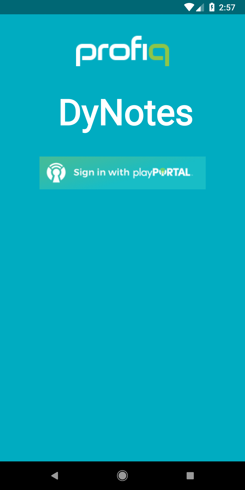
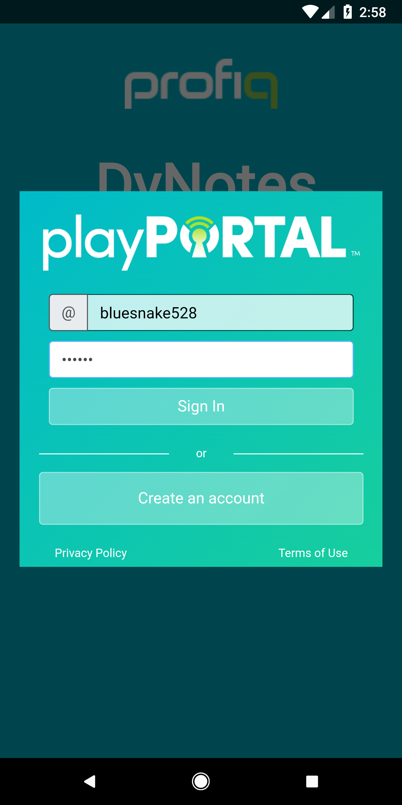
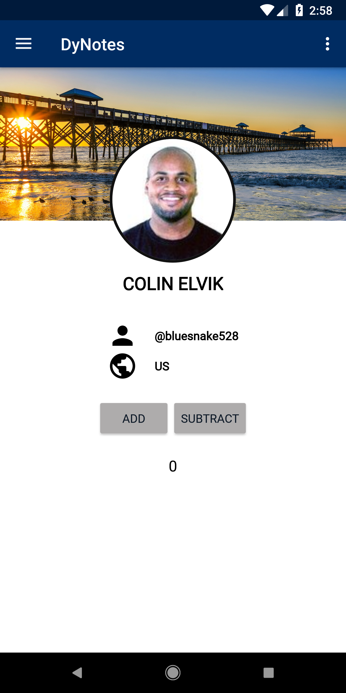
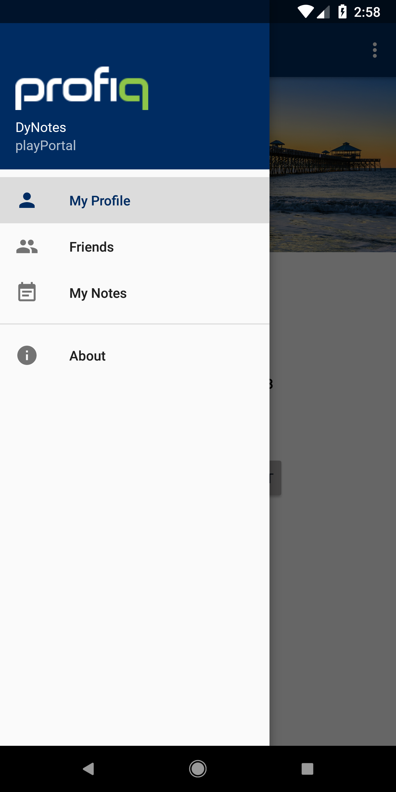
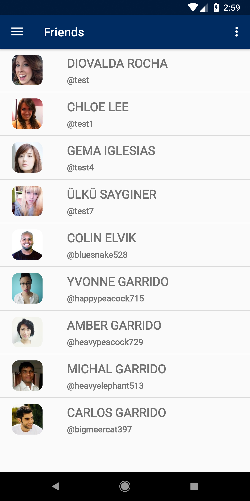
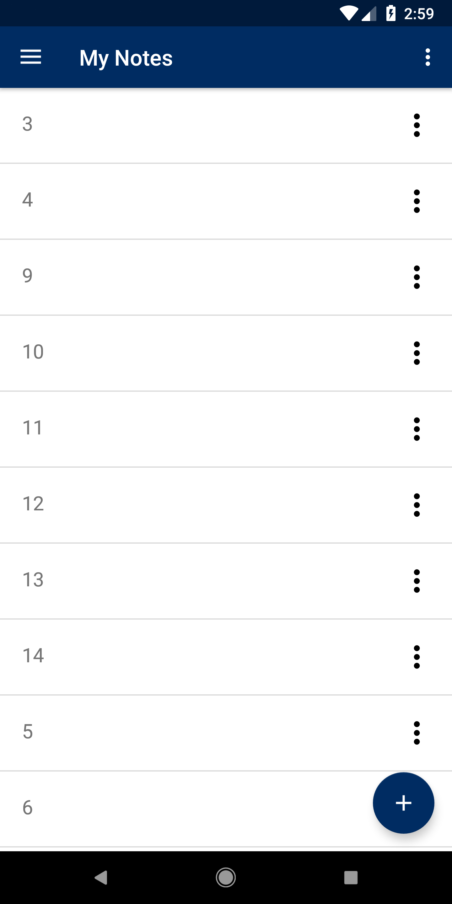
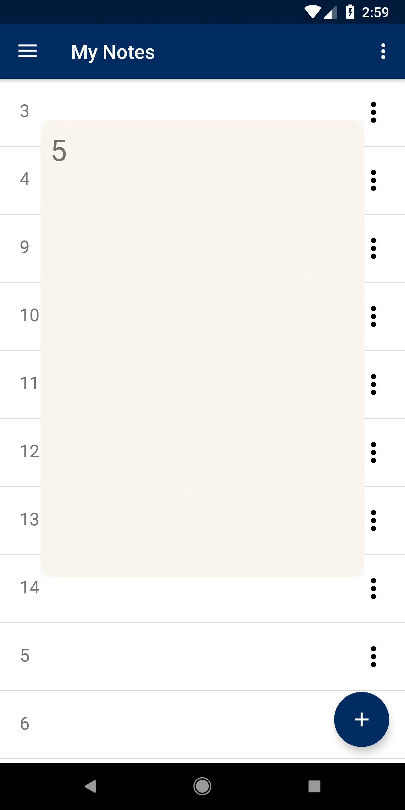
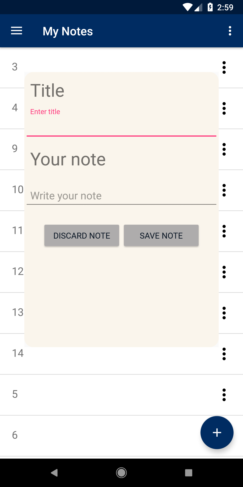
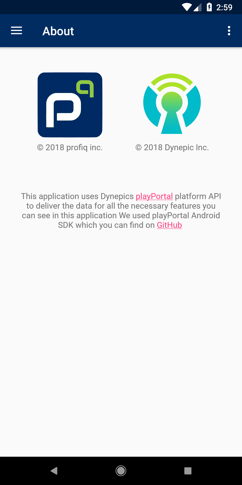

# DyNotes
This app is used to display how does [PlayPortal](https://www.playportal.io/) from [Dynepic](https://www.dynepic.com/) work.
It uses their Android SDK to meet COPPA compliancy.


## Setting up DyNotes
 1. Download and install [Android Studio](https://developer.android.com/studio/)
 2. Clone this repo to your local machine
    ```
    git clone git@github.com:profiq/playportal-notes-android.git
    ```
 3. Create your Account in [PlayPortal studio](https://studio.playportal.io/) 
 and setup your App, steps described [here](https://studio.playportal.io/api/getting-started)
 4. Generate Client ID, secret, Redirect URI and put it into `/app/src/main/res/values/config.xml`
 5. Build the App and install it in android device or emulator
 
## DyNotes interface - Screenshots










## Dynepic PlayPortal SDK:
https://github.com/Dynepic/PPSDK-Android

Note: This repo is used for public disclosure, develop version at 
`https://gitlab.profiq.com/tech-research/dynepic-playPortal-SDK-app`